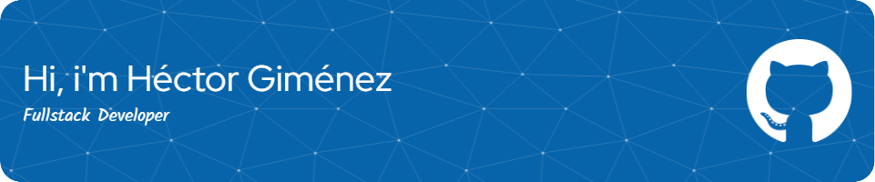

### Glad to see you here!  

I am a Software Developer with over two years of experience and a background in Computer Engineering. I enjoy creating custom software solutions and using modern technologies to build efficient and reliable projects.

I focus on writing clean code, adapting to challenges, and learning new skills. I like working in teams and always aim to deliver high-quality results that meet client needs.

### Languages and tools

#### Frameworks, Platforms

#### Databases

#### Design

### Github Stats  

